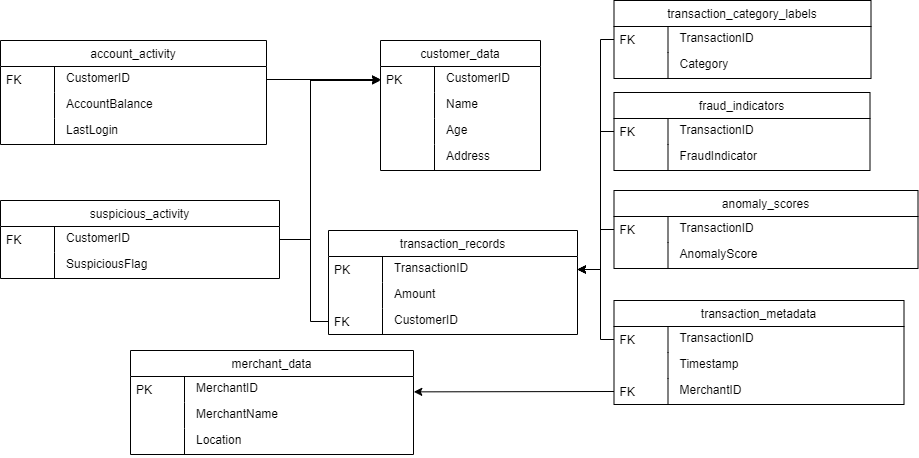

## SQL queries in fraud database
This project intends to explore the fraud database and find out which year and month were the most affected by scams and what the most severe fraudulent transactions looks like. The queries used can be found [here](query.sql).

## Dataset 

The data base is based on one from Aditya Goyal on [Kaggle](https://www.kaggle.com/datasets/goyaladi/fraud-detection-dataset/data). 
It has been randomly populated using a modified Python script that was included in the Kaggle files. The [script](creating_and_populating_database) uses the Faker module to randomise names, places, addresses etc. 

 

| Year | Average Transaction Amount | Total Transactions | Number of Fraud Cases | Percentage of Fraud Cases | Total Amount Lost in Fraud | Average Amount Lost in Fraud |
|------|----------------------------|--------------------|------------------------|----------------------------|----------------------------|------------------------------|
| 2022 | 5007                       | 1006.11            | 261                    | 5.21%                      | 217,517.32                 | 833.40                       |
| 2023 | 4993                       | 1068.53            | 248                    | 4.97%                      | 157,403.40                 | 634.69                       |

 
2022 had around 39 % more monetary value lost to fraud compared to 2023. The fraud cases themselves did not drop that much, which infers that the monetary value of the fraud cases were much higher than the ones in 2023. This is also seen in the average amount.  

If we look closer to highest amounts lost, we see that 2022 have two amounts that are clearly higher than 2023:s cases.

 

| 2022 |	2023 |
| ---- | ---- |
| 21128,4  | 15748,35 |
| 18960,91 |	15533,5 |
| 10463,82 | 9988,9 |
| 10418,43 | 7583,59 |
| 6005,8 | 5388,52 |

 

Let's look closer at the two highest fraudulent transactions of 2022. 

| Timestamp                 | Amount    | Category | Age | Anomaly score |
|---------------------------|-----------|----------|-----| ------------- |
| 2022-03-28 16:28:56.813   | 18,960.91 | Food     | 22  | 0,88          |
| 2022-06-22 08:28:04.970   | 21,128.40 | Travel   | 83  | 0,27          |

The 21 000 transaction is belonging to travel and an older person, which usually is the case for fraud. The other transaction is interesting, as it is a young person and the category is fraud. This might be a case of a new fraud modus, and necessitates a closer look. 

| Age Group | Amount Lost | Number of Fraud Cases |
|-----------|-------------|-----------------------|
| 76-85     | 72,828.45   | 69                    |
| 18-25     | 66,192.36   | 49                    |
| 36-45     | 66,006.92   | 68                    |
| 46-55     | 56,036.41   | 90                    |
| 26-35     | 45,295.63   | 74                    |
| 66-75     | 39,180.34   | 83                    |
| 56-65     | 29,380.61   | 76                    |

The age groups 76-85 and 18-25 correlates with the highest amount of lost monetary value of 2022, as shown before. However, for amount of fraud cases, 76-85 is the third lowest and 18-25 is the lowest victimised, which infers that when these age groups get scammed it is by higher amounts while other age groups get scammed more times with lower amounts.

[Back to main page](./index.md)
