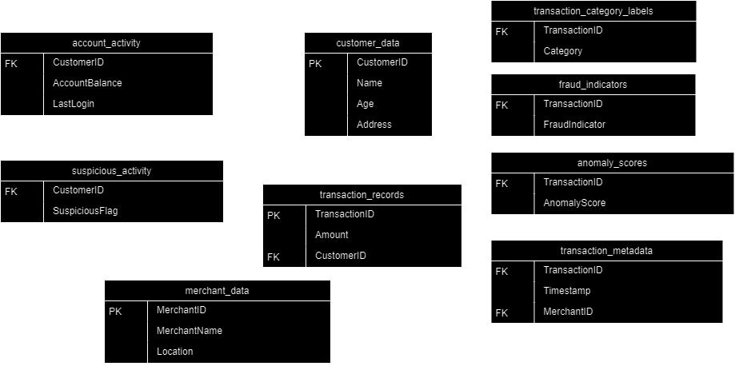

## Portfolio

[Topic modelling of fraud prevention policies](./topicmodelling.md)  
For my master thesis, I examined a larger number of documents regarding fraud prevention using topic modelling. It showcases my ability to code in Python, use Natural Language Processing, and data visualisation using both Python and Tableau.
Skills showcased
- Python programming, including use of Gensim, Pandas, Numpy, and Seaborn
- Machine learning using Natural Language Processing
- Hyperparameter tuning and model optimization.
- Data wrangling and transformation
- Visualisations using Tableau 

[Fraud Database](./SQL_project.md)  
Skills showcased
- Database Design and Schema Creation
- Data import, cleaning, and transformation.
. Writing and optimizing complex SQL queries, including joins, aggregations, CTE, window functions, and UNIONs.

[Fraud prediction](./fraudprediction.md)  
Skills showcased
- Feature engineering
- Python programming, including use of Pandas, Numpy, and Seaborn
- Supervised machine learning model building
- Hyperparameter tuning and model optimization.
- Statistical analysis
- Visualisations using Tableau
  
[Anomaly detection in Fraud prevention set]
Skills showcased
- Python programming, including use of Pandas, Numpy, and Seaborn
- Unsupervised machine learning model building
- Visualisations using Tableau

## Dataset 

The dataset used for all my projects comes from Aditya Goyal on [Kaggle](https://www.kaggle.com/datasets/goyaladi/fraud-detection-dataset/data). 
It has been randomly populated using a modified Python script that was included in the Kaggle files. The [script](creating_random_database) uses the Faker module to randomise names, places, addresses etc.
