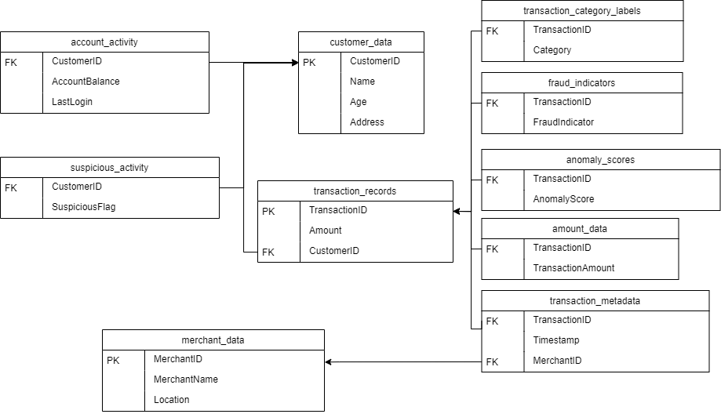

## Portfolio

[Topic modelling of fraud prevention policies](./topicmodelling.md)  
For my master thesis, I examined a larger number of documents regarding fraud prevention using topic modelling. It showcases my ability to code in Python, use Natural Language Processing, and data visualisation using both Python and Tableau.

## Dataset 

The dataset used for all my projects comes from Aditya Goyal on [Kaggle](https://www.kaggle.com/datasets/goyaladi/fraud-detection-dataset/data). 
It has been randomly populated using a modified Python script that was included in the Kaggle files. The script uses the Faker module to randomise names, places, addresses etc.
