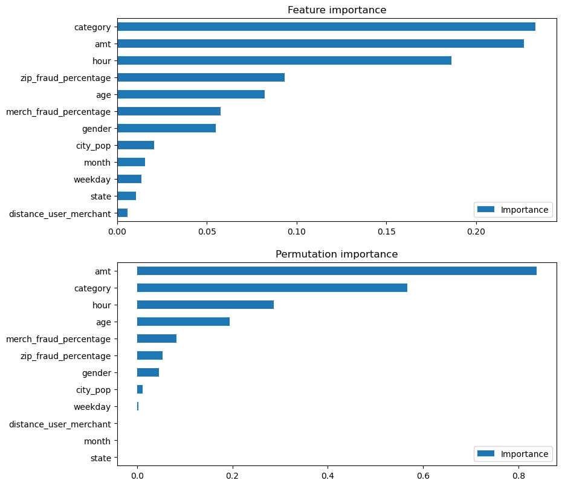
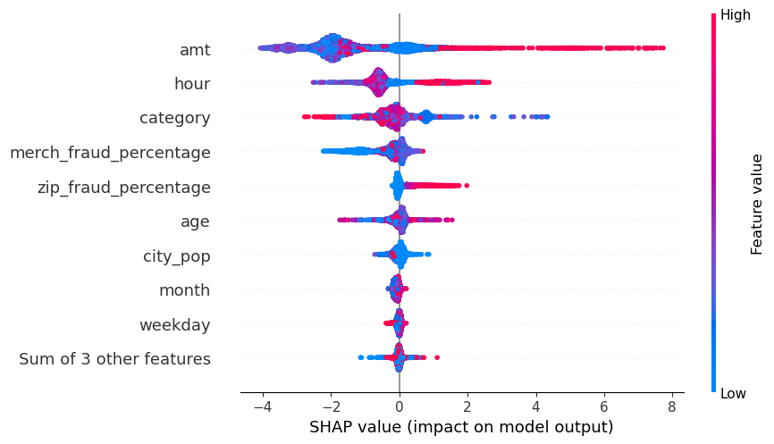

# Fraud Prediction

## Introduction
Fraud is constantly on the rise alongside technology. This makes fraud detection important. The big obstacle is to understand how to detect fraud. This project aims to understand which features have a better ability to predict fraud. This is done with a credit card fraud dataset that gets analyzed with supervised machine learning using the XGBoost algorithm.

## Dataset
The dataset is taken from Kaggle ([https://www.kaggle.com/datasets/kartik2112/fraud-detection](https://www.kaggle.com/datasets/kartik2112/fraud-detection)). It consists of 23 columns and 1,296,674 transactions. It has one binary column, `is_fraud`. With 0, the transaction is genuine and with 1, it is fraudulent. This will be the target variable. The dataset is highly imbalanced, as only 0.58% of all transactions are fraudulent. This is important to consider during the rest of the analysis.

I created new features:

- Hour, month, and weekday are extracted from the timestamp.
- Distance between merchant and user are calculated using their respective coordinates.
- The percentage of fraudulent transactions for each merchant and zip code is created.

## Insights from EDA with Visualizations

- Transaction amounts are very skewed, and fraudulent transactions only take on values from around 1 to 1400 USD. This means that there are large outliers, but these outliers are not relevant for fraud.
- Grocery shopping on location and shopping online are the most common categories of fraudulent transactions.

- Most transactions are made during weekends and during 21:00-22:00 in the evening.
- Age does not have a clear pattern when it comes to fraud, as it is very unevenly distributed.

## Analysis and Results
To understand the most important features, I used four measures:

- **Feature importance:** The XGBoost model can list the features that most contributed to the predictions.
- **Permutation importance:** This explores how important the feature is by measuring the performance of the model with the feature removed. The steeper the drop in performance, the more important the feature is.
- **SHAP values:** SHAP measures feature importance differently by distributing the impact of each feature evenly on the final result.

In general, amount, category, and hour have the most effect on predicting fraud. Amount seems to have higher predicting power according to permutation importance and SHAP values. Category is the most important feature according to feature importance, with amount being a close second. Category and hour alternate in second and third importance across the measures, with age having medium importance in all.

This beeswarm plot shows how each transaction contributed to the prediction of fraud. The X-axis values indicate if the feature lowers or increases the likelihood of fraud. The color shows if the feature values are high or low. Higher values of amount and hour seem to increase the likelihood of fraud. Category is a nominal variable, so the values cannot directly imply likelihood. Lower merchant fraud percentage values lower the likelihood of fraud, while higher zip fraud percentages increase the likelihood.

### Amount
Amount should be examined further. It had the highest explanatory power, though the relationship between amount and fraud is fragmented. All fraudulent transactions in the dataset were in the 0-2000 USD range, with no high outliers, while the amounts for all transactions have more high outliers. This makes it difficult to conclude if a certain amount predicts fraud.

### Age
Age is mildly important according to correlation and feature importance but of low importance with SHAP.

Previous fraud seen in zip codes and merchants are moderately correlated with fraud but are less important in predicting fraud with the machine learning model. Zip code previous fraud percentage is lower in SHAP values but higher in feature importance, while merchant previous fraud is the opposite.

Location and time-based variables did not significantly affect fraud prediction, except for hour, which may indicate that fraud is more likely in the evening (as shown by EDA). Month, though moderately correlated with fraud, lost its importance in the model.

## Conclusion
Amount, category, and hour are the features that can predict fraud the most, with previous fraud and age as complements. Further exploration of amount and category is needed to understand their predictive power and interaction.
