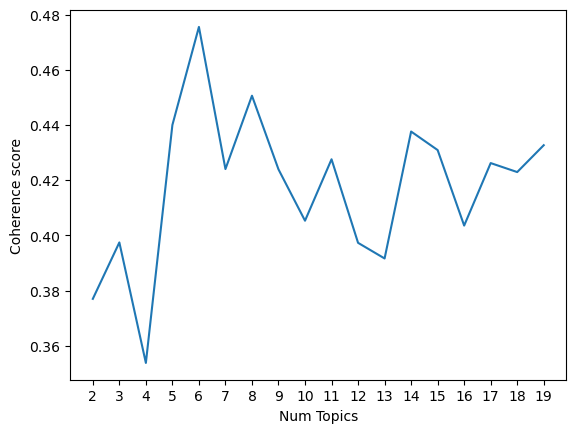

### Introduction
Fraud is a problem that is rising and has gotten attention on a national and international level. My thesis intended to find out how fraud is addressed in policy documents in different sectors in Sweden. It used Topic Modelling using Python.
The full thesis can be found [here](https://lup.lub.lu.se/student-papers/search/publication/9165283).
### Pre-processing
The corpus consisted of 102 documents of different lengths. The first step was to read the documents using the pyPDF2 module and then pre-process the documents. The documents were tokenised, lemmatised, and stop words were removed. 
### Topic modelling 
 <br>
To find out the optimal number of topics, I used a function that compared coherence values for different numbers of topics. This was used with a qualitative analysis of keywords to find which number of topics generated the most useful information.

```
def compute_coherence_values(dictionary, corpus, texts, limit, start, step):
    """This function calculates and returns lists of coherence and perplexity values for different numbers of topics"""

    # Lists to store values are intialised
    coherence_values = []
    perplexity_values = []
    model_list = []
    top_words_list = []  
    topic_labels_list = [] 
    
    # Now the model are created, iterating through different numbers of topics. Random state is used to make the result replicable.
    for num_topics in range(start, limit, step):
        lda_model = models.LdaModel(corpus=corpus, id2word=dictionary, num_topics=num_topics, passes=6, random_state=8366) 
        # The model is added to the list
        model_list.append(lda_model)
        
        # Computing coherence score and adding to list
        coherencemodel = CoherenceModel(model=lda_model, texts=texts, dictionary=dictionary, coherence='c_v')
        coherence_values.append(coherencemodel.get_coherence())

        # Perplexity is computed and added to the list
        perplexity = lda_model.log_perplexity(corpus)
        perplexity_values.append(perplexity)
        
        # Adding top words for each model for qualitative assessment
        top_words = lda_model.print_topics(num_words=5) 
        top_words_list.append(top_words)
        
        # Making labels for each topic
        topic_labels = [f"Topic {i+1}" for i in range(num_topics)]
        topic_labels_list.append(topic_labels)

    return model_list, coherence_values, perplexity_values, top_words_list, topic_labels_list
```
The number of topics after the analysis was settled on 6.
| Topic 1                                | Topic 2                           | Topic 3                               |
|----------------------------------------|-----------------------------------|---------------------------------------|
| **Rules and Regulations on an EU-level** | **Information-based Fraud Prevention** | **Banks’ Responsibilities in Fraud Prevention** |
| medlemsstat                            | bankkort                         | villaägare                           |
| skall                                  | närstående                       | bankbedrägerier                      |
| direktiv                               | påstå                            | kontoinformation                     |
| bestämmelse                            | prata                            | betaltjänstdirektivet                |
| betalningsinstrument                   | kortbedrägeri                    | sparbank                             |
| förordning                             | gammal                           | betalning                            |
| behörig                                | samtal                           | stoppa                               |
| byrå                                   | lur                              | betaltjänstlagen                     |
| bilaga                                 | uppmaning                        | falsk                                |
| kund                                   | svårlurad                        | bankbedrägerierna                    |

| Topic 4                                | Topic 5                           | Topic 6                               |
|----------------------------------------|-----------------------------------|---------------------------------------|
| **Discovering and Reporting Fraud**    | **Cost of Fraud**                 | **Online Fraud Awareness and Prevention** |
| besparing                              | kostnad                          | mejl                                 |
| kopia                                  | brottslighet                     | faktura                              |
| logga                                  | procent                          | kortuppgifter                        |
| polisanmälan                           | konsument                        | säljare                              |
| stoppa                                 | tillsyn                          | aldrig                               |
| agera                                  | företag                          | tipsa                                |
| bankid                                 | finansinspektion                 | bestrida                             |
| genomskåda                             | verksamhet                       | annons                               |
| uppmaning                              | stöld                            | lösenord                             |
| omöjlig                                | drabba                           | bankid                               |

 
### Heat map


### t-SNE

T-SNE is an algorithm that can display higher dimension data on a lower scale, which makes it popular for visualisation as it can visualise how e.g. topics are clustered together in a 2D-plane (Sharma and Sharma, 2023). This cluster map (Figure 10) shows the distribution of documents and topics. Each colour is a topic, and each shape is a sector. The topics are generally clustered together, with some overlap between topics 1 and 5, as well as topics 2 and 3. Topic 6 has an outlier from the governmental sector in the lower left corner. Topics 5, 6, and 1 seem to be closer together, while topics 2 and 3 are closer. Topic 4 does not appear in the map, which corresponds to the lower likelihood of it appearing according to Figure 7 earlier. Topic 3 is dominated by the banking sector, but no inferences can be drawn from the other topics because of the skewed sampling. Topics 2, 3 and 5 seem to have the most spread, while the other topics are more grouped. 
### Tableau visualisations


