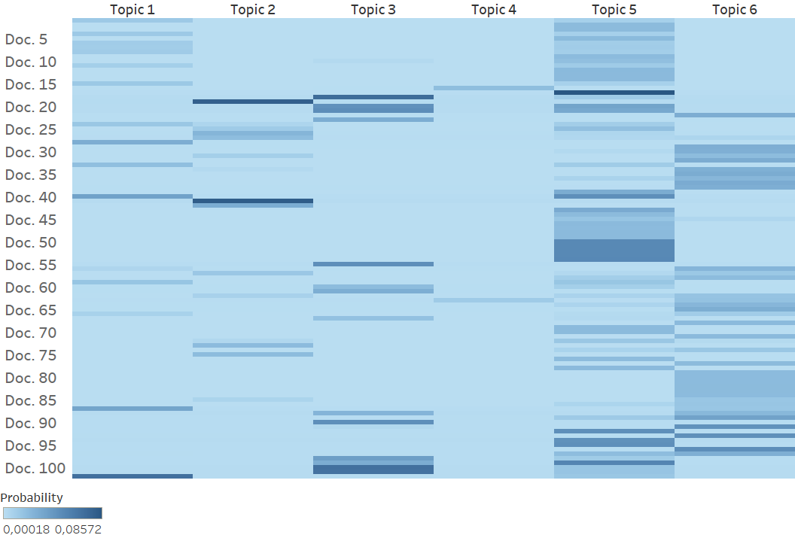
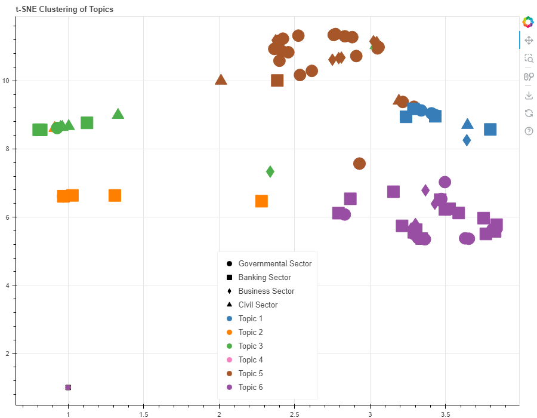

### Introduction
Fraud is a problem that is rising and has gotten attention on a national and international level. My thesis intended to find out how fraud is addressed in policy documents in different sectors in Sweden. It used Topic Modelling using Python.

The different sectors are the following: governmental, civil, banking, and private.

The full thesis can be found [here](https://lup.lub.lu.se/student-papers/search/publication/9165283).
### Pre-processing
The corpus consisted of 102 documents of different lengths. The first step was to read the documents using the pyPDF2 module and then pre-process the documents. The documents were tokenised, lemmatised, and stop words were removed. 
### Topic modelling 

The number of topics that I deemed suitable was 6. The following table shows each topic with the associated key words.

| Topic 1                                | Topic 2                           | Topic 3                               |
|----------------------------------------|-----------------------------------|---------------------------------------|
| **Rules and Regulations on an EU-level** | **Information-based Fraud Prevention** | **Banks’ Responsibilities in Fraud Prevention** |
| medlemsstat                            | bankkort                         | villaägare                           |
| skall                                  | närstående                       | bankbedrägerier                      |
| direktiv                               | påstå                            | kontoinformation                     |
| bestämmelse                            | prata                            | betaltjänstdirektivet                |
| betalningsinstrument                   | kortbedrägeri                    | sparbank                             |
| förordning                             | gammal                           | betalning                            |
| behörig                                | samtal                           | stoppa                               |
| byrå                                   | lur                              | betaltjänstlagen                     |
| bilaga                                 | uppmaning                        | falsk                                |
| kund                                   | svårlurad                        | bankbedrägerierna                    |

| Topic 4                                | Topic 5                           | Topic 6                               |
|----------------------------------------|-----------------------------------|---------------------------------------|
| **Discovering and Reporting Fraud**    | **Cost of Fraud**                 | **Online Fraud Awareness and Prevention** |
| besparing                              | kostnad                          | mejl                                 |
| kopia                                  | brottslighet                     | faktura                              |
| logga                                  | procent                          | kortuppgifter                        |
| polisanmälan                           | konsument                        | säljare                              |
| stoppa                                 | tillsyn                          | aldrig                               |
| agera                                  | företag                          | tipsa                                |
| bankid                                 | finansinspektion                 | bestrida                             |
| genomskåda                             | verksamhet                       | annons                               |
| uppmaning                              | stöld                            | lösenord                             |
| omöjlig                                | drabba                           | bankid                               |

 
### Heat map

This heatmap shows how important each document is for each topic. Topic 5 seems to be the most important across the corpus, while topic 4 is the least important.

This heatmap shows how important each document is for each sector. Also here, topic 5 is the most important one for all sectors. The civil sector seems to be an outlier as topic 3 is important for them, while topic 6 is not, unlike the other sectors. 

### t-SNE

T-SNE is an algorithm that can display higher dimension data on a lower scale, which makes it popular for visualisation as it can visualise how e.g. topics are clustered together in a 2D-plane. This cluster map shows the distribution of documents and topics. Each colour is a topic, and each shape is a sector. The topics are generally clustered together, with some overlap between topics 1 and 5, as well as topics 2 and 3. Topic 6 has an outlier from the governmental sector in the lower left corner. Topics 5, 6, and 1 seem to be closer together, while topics 2 and 3 are closer. Topic 4 does not appear in the map, which corresponds to the lower likelihood of it appearing according to Figure 7 earlier. Topic 3 is dominated by the banking sector, but no inferences can be drawn from the other topics because of the skewed sampling. Topics 2, 3 and 5 seem to have the most spread, while the other topics are more grouped. 

### Conclusions
The topics generally focused on situational crime prevention, and it was especially seen as a
responsibilisation of the individual. Further, especially the civil sector wanted to put the
responsibility on the banking sector. This implies that the perpetrator cannot be dealt with and
that the victims must prevent their own victimisation, or that an actor in power, such as the
banks, is the one responsible for prevention. This implies further that the perpetrator and
space are irrelevant and with the larger scope, a new type of crime prevention is necessary.
When it comes to prevention, the banking sector governs and is governed by the civil sector,
while the governmental sector governs the banking sector. This implies that the banking
sector is a central actor that has demands from different actors and an expectation to handle
the fraud risk.

